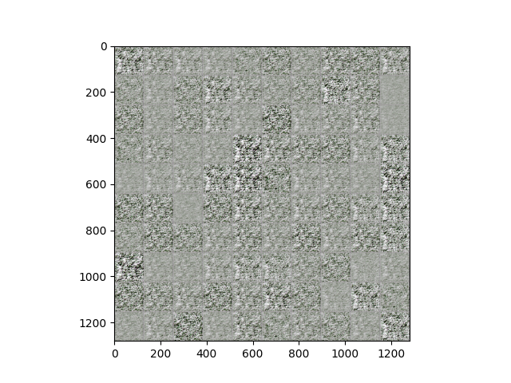

# Документация по эксплуатации модели image_denoiser.

---
## 1. Иниациализация модели. 
- для инициализированна модели нужно указать в качестве ее аргументов либо путь до json файла с конфигурациями через аргумент file_path, либо dict в качестве аргумента params_json, после чего модель будет инициализированна.
- Описание параметров:
    - input_sh: (tuple) = выходная разрменость подоваемых в модель изображений
    - hiden_dim: (int) = размерность вектора в который будет кодироваться так каждое изображение
    - encoder_out_activation: (str) = выходная функциия активации слоя Encoder
    - encoder_conv_kernel_size: (list) = список размерности ядер свертки для каждолго из слоев энкодера
    - encoder_conv_strides: (list) = список шагов свертки для каждого из слоев энкодера
    - ### тот же набор параметров мы используем и для декодера

---
## 2. Обучени модели. Для запуска пробной сесси обучения модели необходимо указать локальный путь дор набора данных в json конфигуратор trainer_confs.json. Важо чтобы в каждой директории хранились лишь изображения которые мы будете использовать для обучения

- Описание параметров:
    - run_folder (str) - путь до директории в которой бует храниться сгенерированные семплы и веса модели
    - train_tensor, train_label: (np.ndarray) = набор данных для обучепния модели
    - epochs: (int) = кол.во итераций обучения
    - batch_size: (int) = размер выборки обучения
    - epoch_per_save: (int) = шаг генерации семплов для детектинга работы сети
    - gen_encoded_sample: (Bool) = гейт для сохранения распрпределения энкодера

- По мере обучения модель будет генерировать следующие семплы:
    
---

## 3. Использование весов модели. В паапке model_saves лежат семплы сгенерированные моделью на каждого шаге генерации и а также ее веса. Для использования весов достаточно использовать функцию load_weigths() оброщаясь к нашей модели. Файл с весами имеет тип расширнения: weights.weights.h5.
